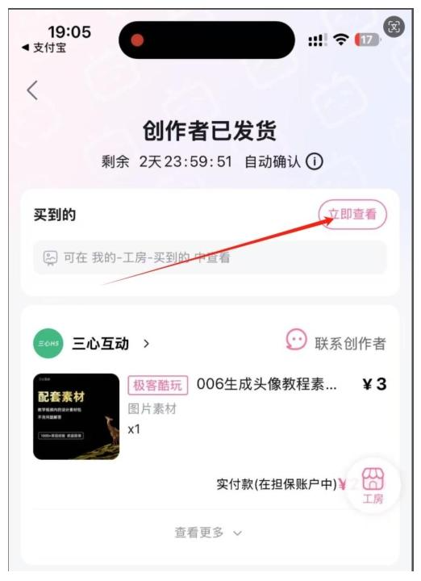
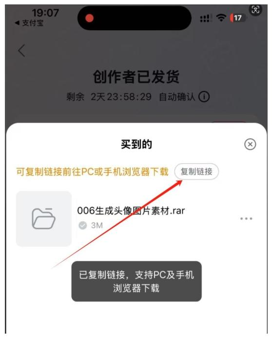
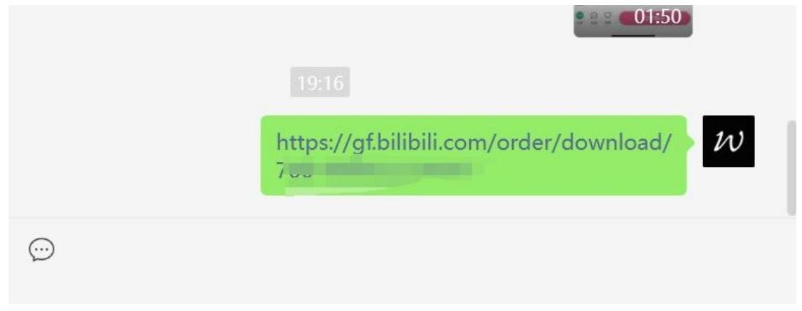
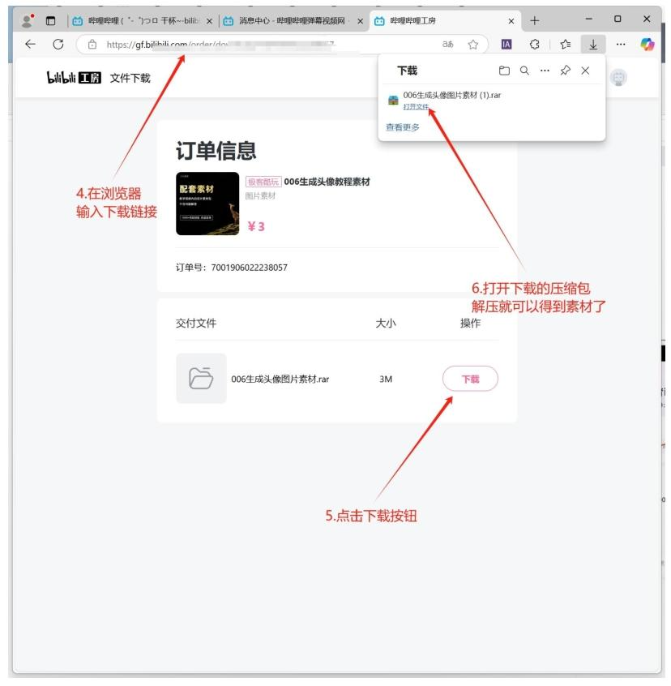

# 📥 工坊商品下载指南

---

## 📋 说明
素材无法直接在手机上下载使用，需要复制链接到电脑下载才正常打开。

---

## 🚀 操作路径如下

### 步骤 1：手机点击立即查看
在手机上找到相关操作界面，点击“立即查看”。

### 步骤 2：复制链接
点击“复制链接”，此时会提示“已复制”。

### 步骤 3：链接传输至电脑
将复制好的链接发送到电脑，然后在电脑上再次复制该链接。

### 步骤 4：浏览器输入链接
打开电脑上的浏览器，将复制的链接粘贴到地址栏并回车。

### 步骤 5：开始下载
在打开的页面中，找到下载按钮并点击“下载”。

### 步骤 6：解压使用
下载完成后，找到下载的文件进行解压，解压后即可使用素材。

---

希望以上教程能帮助你顺利下载并使用素材！如果在操作过程中遇到任何问题，请随时联系UP主。 
